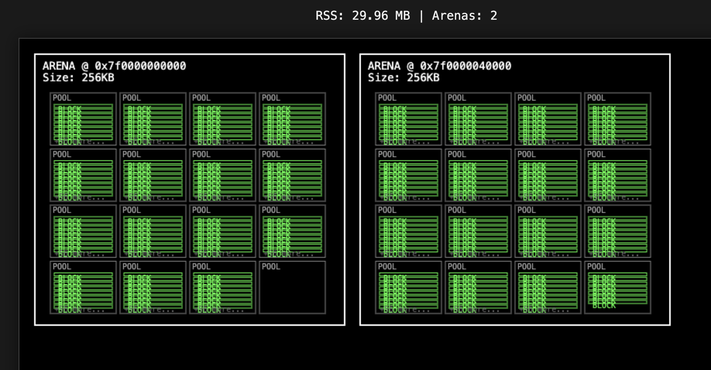

# 🐍 Python Memory Watch

Веб-визуализатор для отслеживания использования памяти Python-приложениями в реальном времени, с симуляцией иерархии `pymalloc`: **Арены → Пулы → Блоки**.

Этот инструмент помогает наглядно увидеть, как ваш код, создающий множество мелких объектов (< 512 байт), заполняет память, управляемую Python.




## ⚙️ Как это работает

*   **`python-memwatch`** — это CLI-команда, которая запускает веб-сервер на Flask и ваш скрипт.
*   **`tracemalloc`** используется для отслеживания памяти, выделенной самим Python.
*   **Симуляция** — на основе данных `tracemalloc` строится *модель* распределения этой памяти по иерархии pymalloc:
    *   **Арены**: участки по 256 КБ.
    *   **Пулы**: участки по 4 КБ внутри арен.
    *   **Блоки**: участки под конкретные объекты внутри пулов.
*   **Веб-интерфейс** на `<canvas>` отрисовывает эту модель, показывая занятые и свободные участки.

> **Важно**: Это не прямой дамп памяти, а высокоуровневая симуляция, основанная на реальных измерениях объема потребляемой памяти.

## 🚀 Установка

Для установки и использования проекта рекомендуется использовать виртуальное окружение.

**1. Клонируйте репозиторий (если нужно):**
```bash
git clone https://github.com/your-username/python-memwatch.git
cd python-memwatch
```

**2. Создайте и активируйте виртуальное окружение:**
```bash
# Создаем venv
python3 -m venv venv

# Активируем (Linux/macOS)
source venv/bin/activate

# Активируем (Windows)
# venv\Scripts\activate
```

**3. Установите пакет в режиме разработки (`editable`):**
Эта команда свяжет `python-memwatch` с вашим исходным кодом, и все изменения будут сразу же применяться.
```bash
pip install -e .
```

## 📈 Использование

Есть два способа использования:

### 1. Анализ вашего скрипта (основной способ)

Запустите ваш скрипт через `python-memwatch`.

```bash
python-memwatch /путь/к/вашему/скрипту.py
```

**Пример:**
```bash
python-memwatch example.py
```

**Что произойдет:**
1.  Запустится веб-сервер. Вы увидите в консоли сообщение: `🚀 Memory Visualizer: http://localhost:5000`.
2.  Сразу после этого начнет выполняться ваш скрипт (`example.py`).
3.  Откройте в браузере **`http://localhost:5000`**, чтобы в реальном времени наблюдать за заполнением памяти.

### 2. Демонстрационный режим

Если запустить команду без аргументов, она запустит встроенную симуляцию для демонстрации.

```bash
python-memwatch
```
Откройте **`http://localhost:5000`** и увидите, как память "заполняется" и "очищается" в цикле.

---